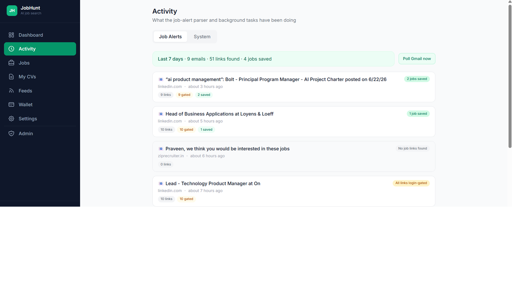
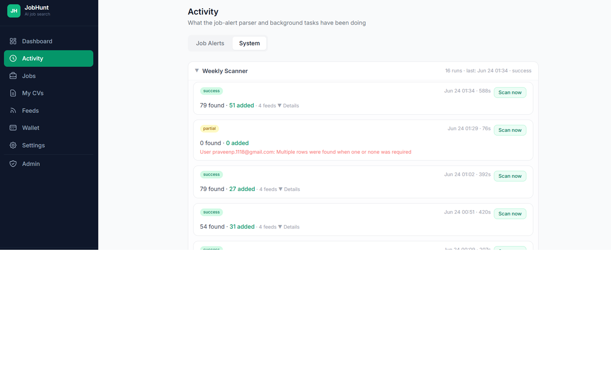
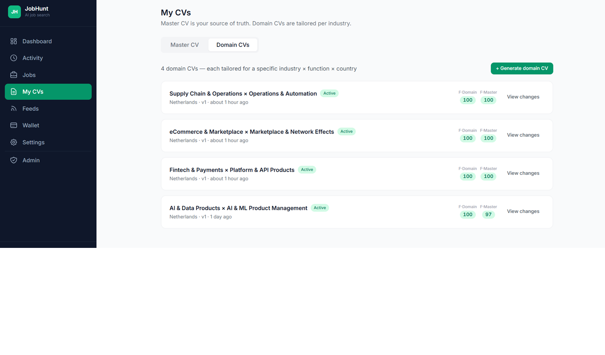

<div align="center">

# JobHunt

**AI-powered job search platform for senior product leaders**

[](https://praveenp1118.github.io/JobHunt)


📖 **[Live documentation site →](https://praveenp1118.github.io/JobHunt)**

</div>

---

## Overview

JobHunt automates the highest-effort parts of a senior product leadership job search. It scans
curated job feeds and Gmail job-alert digests, scores every opportunity against your **master CV**
and multiple **domain-specific CVs**, then tailors your CV and cover letter for each role — making
only bounded, factual edits and **never inventing experience**. Everything is tracked end-to-end,
from discovery to application to recruiter follow-up.

It runs entirely on a local Docker stack; each user brings their own AI (Anthropic) and
scraping (Apify) API keys.

## Key features

- **AI CV tailoring** — per-job CV + cover letter with a strict *golden rule* (reorder, rephrase,
  inject keywords, deselect — never invent), gated by a factual-integrity score before sending.
- **Multi-domain scoring** — every job is scored against the master CV **and all** active domain
  CVs; the best-fit domain surfaces automatically and pre-selects when you tailor.
- **Hybrid-RAG scoring pipeline** — a 3-stage funnel cuts scoring cost ~**82%** with no quality loss on
  saved jobs: Stage 1 keyword pre-filter (free) → Stage 2 essence scoring (Haiku) → Stage 3 full-CV scoring
  (Sonnet, borderline jobs only). The CV "essence" is extracted once and cached. Three presets (Maximum
  Quality / Balanced / Max Savings) + a live cost calculator in Settings, plus an optional **night-batch**
  mode that scores the day's jobs cheaply at 2 AM.
- **Tiered-model cost optimization** — every Claude call uses the cheapest sufficient model: email
  classification is rules-first (free) then Haiku; JD highlights are Haiku + **cached per job**; feed keywords
  and CV→markdown use Haiku; career insights run on the CV essence. The API Usage tab shows the model tier
  (Haiku / Sonnet / Opus) and ₹ cost per call.
- **Email-to-JobHunt** — forward any job URL to your job-search Gmail with a subject containing `jobhunt`
  or starting with `jh:`; it's auto-fetched, parsed, scored, and saved (📥 Email source) with a confirmation
  email back to you.
- **Auto-detect external applications** — the Gmail poll recognises LinkedIn / Indeed "application sent /
  received" confirmations, flips the matching tracked job to **Applied**, and links the email — or adds the
  job if it wasn't tracked.
- **Gmail job-alert parser** — detects LinkedIn / Indeed / company alert digests (rule-based, no
  AI cost) and extracts job cards straight from the email body for login-gated sources.
- **Feed scanner** — scheduled RSS + Apify (LinkedIn, Google Jobs) scanning, with domain-CV-driven
  keyword profiles and a free keyword pre-filter before any paid scoring call.
- **Activity dashboard** — per-feed scan funnels (`raw → pre-filter → above-threshold → saved`),
  job-alert timelines, error logs, and manual "run now" controls.
- **Application tracking** — full pipeline (`new → applied → interview → offer → ghosted`), recruiter
  email threads, human-in-the-loop reply approval, and automatic follow-up drafting.
- **Career Insights ✨** — one cached (7-day) batch Claude call across all your tracked JDs produces a
  readiness score and a 7-tab gap analysis (Readiness · Keywords · Skills · Experience · Certifications ·
  Build · Roadmap) with a checkable improvement roadmap and a Dashboard readiness widget.
- **API usage visibility** — every Claude + Apify call is logged with token counts and ₹/$ cost; inline
  token badges appear at the point of action (12 locations) plus a Settings → API Usage tab with CSV export.
- **Support chat** — an in-app widget on every page: a rule-based FAQ bot (12 categories, **no AI cost**)
  with live WebSocket hand-off to an admin when online, or a ticket + email when offline.
- **Community insights** — opt-in, fully anonymised sharing of job scores + JD highlights + tailoring
  patterns (never CV content or PII); recipients spend **0 tokens**. Surfaces only at ≥2 contributors.
- **Subscriptions** — Stripe-powered JobHunt Pro (₹500/mo); paid write actions are gated, with read-only
  access on expiry (admins bypass).
- **Templates** — one global CV template (font / size / margins / accent / bullets → deterministic PDF
  styling) plus content rules (never-modify sections, section order, page budget) injected into the tailor
  prompt; per-domain overrides, live previews, and an overflow "trim to fit" guard.
- **Security & governance** — AES-256 encryption, bcrypt + JWT, per-user **rate limiting**, **prompt-injection
  hardening** (XML-tagged user content), an **anti-hallucination** check (no invented metrics), security-headers
  middleware, Redis **login lockout**, and an immutable **audit log**.
- **GDPR self-service** — Settings → Privacy: data summary, one-click **JSON/markdown export** (ZIP),
  rate-limit transparency, and **right-to-erasure** with a 30-day grace period; admins get a Governance dashboard.

## Screenshots

**Job Tracker** — every job scored against your master CV and all domain CVs (B · Best Fit · T · F):


**AI Tailor** — bounded change log with a live CV / cover-letter / email preview:


**Activity dashboard** — per-feed scan funnels and job-alert timelines:





<table>
  <tr>
    <td width="50%" valign="top"><b>Domain CVs</b><br/></td>
    <td width="50%" valign="top"><b>Feeds &amp; scanning</b><br/></td>
  </tr>
</table>

## The scoring model

| Score | Meaning | Computed |
|---|---|---|
| **S1** | Base fit — JD vs **master CV** | At ingest |
| **S1d** | Contextual fit — JD vs **best-matching domain CV** (scored against all, highest wins) | At ingest |
| **S2** | Tailored fit — JD vs the **tailored CV** | After applying tailor changes |
| **S3** | **Factual integrity** — % of the tailored CV traceable to the master CV | After applying — hard send-gate (≥90 green · 85–89 amber · <85 blocked) |

## Architecture

Local Docker deployment — six services. The Celery worker drives the input pipelines; the
FastAPI backend serves the React tracker and orchestrates AI calls.

```
   ┌───────────────────┐         ┌────────────────────────┐         ┌──────────────┐
   │  React Frontend   │ ───────▶│   FastAPI Backend      │ ───────▶│  PostgreSQL  │
   │  (Vite, :3000)    │  HTTPS  │   (:8000)              │  async  │              │
   └───────────────────┘         └───────────┬────────────┘         └──────────────┘
                                             │                        ┌──────────────┐
                                             ├───────────────────────▶│    Redis     │
                                             │   Anthropic Claude      │  (broker)    │
                                             ▼                         └──────┬───────┘
                                   ┌────────────────────┐                     │
                                   │  Claude (user key) │                     ▼
                                   └────────────────────┘            ┌──────────────────┐
                                                                     │  Celery Worker   │
                                                                     │  + Celery Beat   │
        ┌──────────────────────────────────────────────────────────┴──────────────────┤
        ▼                       ▼                        ▼                    ▼
  ┌────────────┐         ┌────────────┐          ┌──────────────┐     ┌──────────────┐
  │ Gmail IMAP │         │ RSS Feeds  │          │ Apify Actors │     │  Playwright  │
  │  + SMTP    │         │            │          │              │     │  (title, PDF)│
  └────────────┘         └────────────┘          └──────────────┘     └──────────────┘
```

See the full write-up in **[docs/architecture.md](docs/architecture.md)**.

## Tech stack

| Layer | Technology |
|---|---|
| Backend | FastAPI, SQLAlchemy (async), Alembic, PostgreSQL |
| Auth | FastAPI-Users, JWT, Google OAuth |
| Frontend | React (Vite) + Tailwind CSS, Zustand, TanStack Query, Recharts |
| AI | Anthropic Claude (each user's own API key) |
| Task queue | Celery + Redis + Celery Beat |
| Email | Gmail IMAP (poll) + SMTP (send), BeautifulSoup HTML parsing |
| Job scanning | RSS feeds + Apify actors |
| Browser / PDF | Playwright (title pre-filter + HTML→PDF) |
| Payments | Stripe (JobHunt Pro subscription) |
| Real-time | WebSockets (support chat) |
| Security | AES-256, bcrypt, JWT, security headers, per-user rate limiting, Redis login lockout, audit log |
| Testing | pytest + pytest-asyncio (in-container live-server smoke tests) |

## Project structure

```
JobHunt/
├── backend/            # FastAPI app
│   └── app/
│       ├── agents/     # Claude-powered agents (CV, JD, tailor, scanner, gmail)
│       ├── mcp/        # External clients (Gmail IMAP/SMTP, Apify, RSS)
│       ├── models/     # SQLAlchemy models
│       ├── routers/    # API routes
│       ├── tasks/      # Celery tasks (scanner, gmail polls)
│       └── utils/      # PDF, encryption, storage, model helpers
├── frontend/           # React (Vite) SPA
├── docs/               # GitHub Pages documentation site
├── docker-compose.yml
└── CLAUDE.md           # Single source of truth for project state
```

## Getting started

> Requires Docker + Docker Compose.

```bash
# 1. Configure environment (fill in your own keys — never commit .env)
cp .env.example .env

# 2. Start the stack
docker-compose up -d

# 3. Apply database migrations
docker-compose exec backend alembic upgrade head
```

- Frontend → http://localhost:3000
- Backend API → http://localhost:8000

Each user supplies their own **Anthropic API key** (for AI) and optional **Apify token**
(for scraping) and **Gmail app password** (for email) in the app's Settings.

## Testing

```bash
docker-compose exec backend pytest tests/ -v
```

The suite runs **in-container against the live uvicorn server** over real HTTP against the real
Postgres DB — **114 smoke tests** covering the API, scanner, Gmail alert parser, multi-domain scoring,
the hybrid-RAG pipeline, tiered-model optimization, billing, governance, templates, and more.

## Documentation

- 🌐 **[Live docs site](https://praveenp1118.github.io/JobHunt)** — landing page + architecture / features / API
- [docs/architecture.md](docs/architecture.md) · [docs/features.md](docs/features.md) · [docs/api.md](docs/api.md)
- [CLAUDE.md](CLAUDE.md) — detailed, evolving project-state document

## Status

Active personal project. Core platform (V1–V3) is **feature-complete**: CV management, AI tailoring,
multi-domain scoring, the **hybrid-RAG scoring pipeline** + tiered-model cost optimization, feed scanning,
Gmail alert parsing, **Email-to-JobHunt**, auto-detected applications, the activity dashboard, Career
Insights, API usage visibility, support chat, community insights, Stripe subscriptions, CV templates, and a
security-first governance layer (rate limiting, prompt-injection hardening, audit logs, GDPR export/erasure)
with static legal pages + registration consent. **114 smoke tests passing.**

## License

Personal project — no open-source license is currently applied (all rights reserved).
